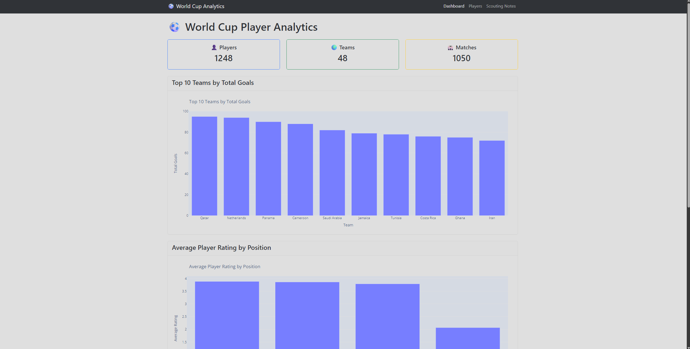
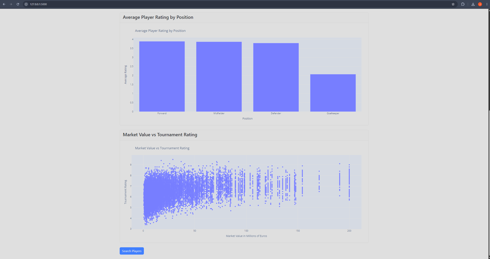
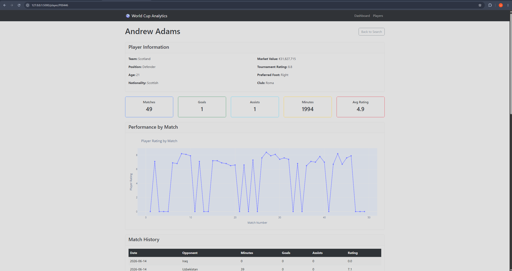
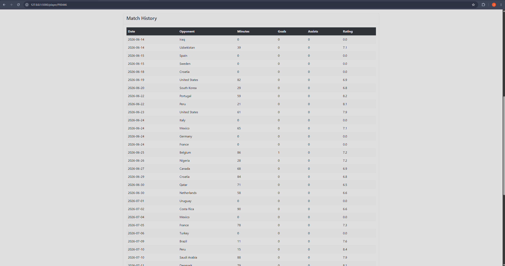
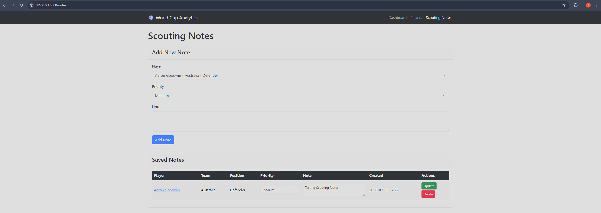

# ⚽ World Cup Player Analytics

Final project for **DSCI-D532 Applied Database Technologies** at Indiana University.

## Project Overview

World Cup Player Analytics is a Flask web application for exploring FIFA World Cup player performance data. The project demonstrates the complete data lifecycle by importing raw CSV data into a normalized MySQL database, querying the data with SQL, and displaying interactive dashboards through a Flask web interface.

Users can search players, analyze performance trends, view individual player profiles, and manage scouting notes through a responsive web application.

## Features

- Dashboard with player, team, and match summaries
- Interactive Plotly visualizations
- Player search and position filtering
- Individual player profile pages
- Match history and performance charts
- Scouting Notes CRUD functionality
- Responsive Bootstrap interface
- MySQL relational database backend
- Flask application using SQL queries instead of CSV data

## Screenshots

### Dashboard Overview



### Dashboard Analytics



### Player Details



### Additional Player Details



### Scouting Notes (CRUD)



---

## Database Design

The application uses a normalized MySQL database consisting of the following primary tables:

- Players
- Teams
- Matches
- Player Match Statistics
- Player Tournament Statistics
- Stadiums
- Scouting Notes

Raw player performance data is imported from a CSV file, normalized into relational tables, and accessed through SQL queries within the Flask application.

---

## Technologies Used

- Python
- Flask
- MySQL
- MySQL Connector/Python
- Pandas
- Plotly
- Bootstrap 5
- Git & GitHub

---

## Project Structure

```
worldcup-player-analytics/
│
├── app.py
├── requirements.txt
├── database/
│   ├── db.py
│   ├── projectfifa.sql
│   ├── application_queries.sql
│   └── create_database.py
│
├── templates/
├── static/
├── screenshots/
└── fifa.csv
```

---

## Running the Application

Install the required packages:

```bash
pip install -r requirements.txt
```

Configure your MySQL connection (host, username, password, and database) in your environment or `database/db.py`.

Start the Flask application:

```bash
python app.py
```

Then open:

```
http://127.0.0.1:5000
```

---

## Repository

https://github.com/Jococh3/worldcup-player-analytics

---

## Authors

**Joshua Cochran**
- Flask application
- Dashboard development
- Data visualizations
- Player search and filtering
- Scouting Notes CRUD functionality
- MySQL integration
- GitHub repository and documentation

**Jack Williams**
- Relational database design
- MySQL schema
- Database normalization
- SQL table creation
- Data import scripts
- ER diagram and database documentation

---

Indiana University  
**M.S. in Data Science**  
DSCI-D532 Applied Database Technologies